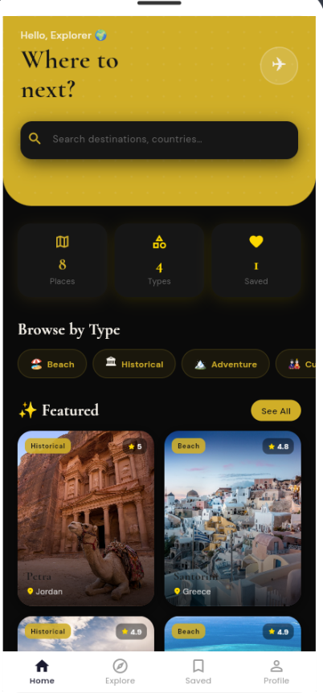
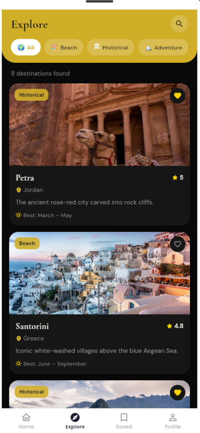
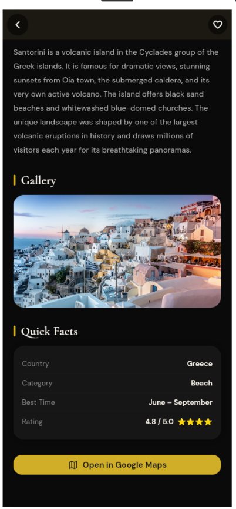
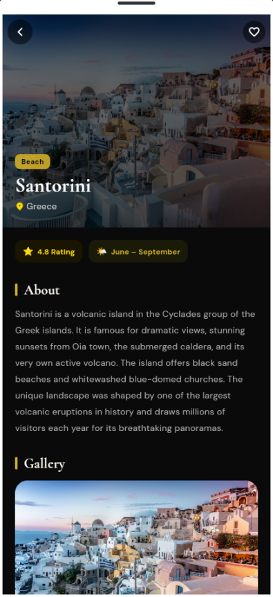
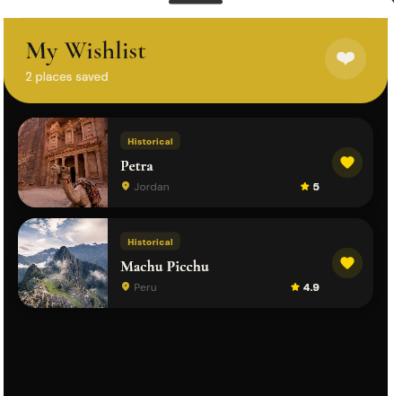
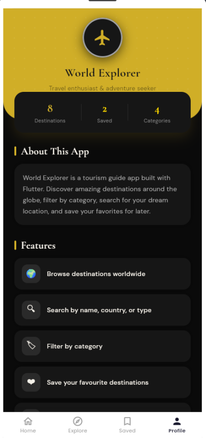

# 🌍 World Explorer

> *"The world is a book, and those who do not travel read only one page."*

A Flutter app for discovering the world's most stunning destinations — search, filter, save your favorites, and open them straight in Google Maps.

---

## 👤 Omar Husam AlShawabkeh &nbsp;·&nbsp; `202110084`

---

## 📸 Screenshots

| Home | Explore | Location |
|:---:|:---:|:---:|
|  |  |  |

| Details | Saved | Profile |
|:---:|:---:|:---:|
|  |  |  |

---

## 🗺️ What's Inside

| | Screen | What it does |
|---|---|---|
| 🏠 | Home | Featured destinations + live stats |
| 🔭 | Explore | Browse all 8 places, search & filter |
| 📍 | Details | Full info + open in Google Maps |
| 🔖 | Saved | Your personal travel wishlist |
| 👤 | Profile | About the app |

---

## ⚡ Tech

```
Flutter  •  Dart  •  google_fonts  •  url_launcher  •  MVC
```

**OOP used:**
- 🔒 **Encapsulation** — destinations list is private, exposed only via a getter
- 🏭 **Factory Constructor** — `CategoryModel.fromMap()` builds objects from a map

---

## 📂 Structure

```
lib/
├── models/          → DestinationModel, CategoryModel
├── controllers/     → TourismController (search, filter, save)
├── screens/         → 5 screens
└── widgets/         → DestinationCard (reusable)
```

---

## 🚀 Run it

```bash
git clone https://github.com/OmarHusam1/world_explorer.git
cd world_explorer
flutter pub get
flutter run
```
